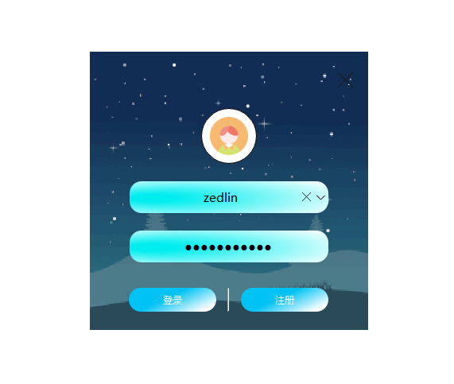
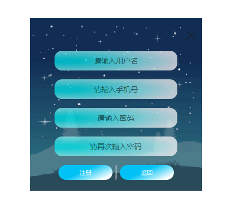
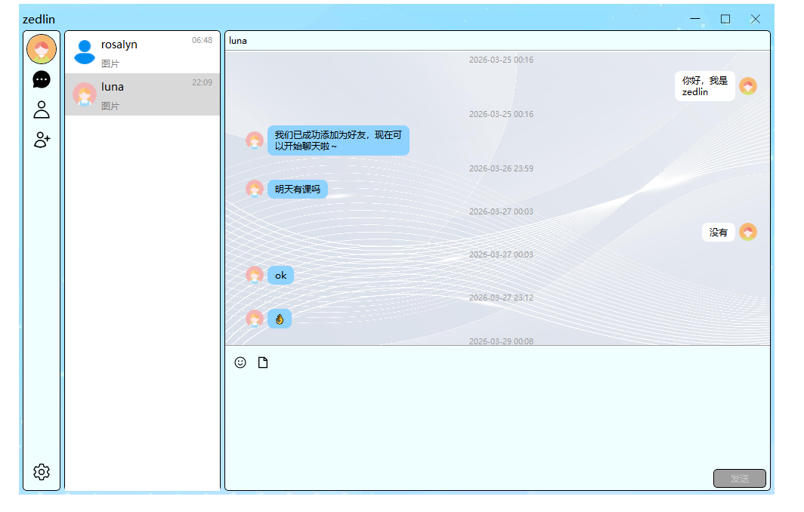
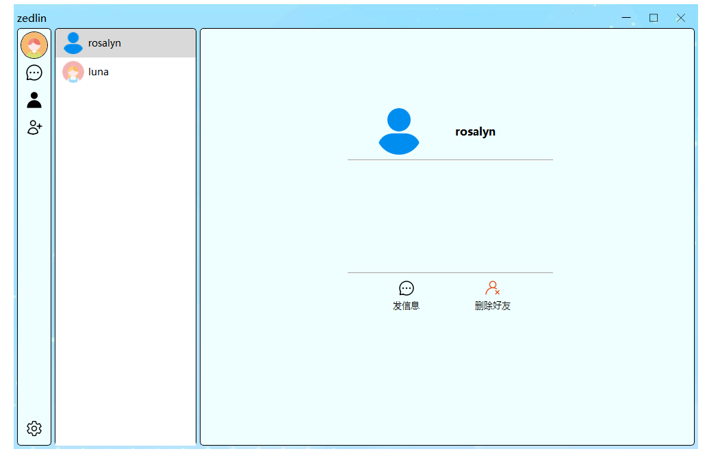
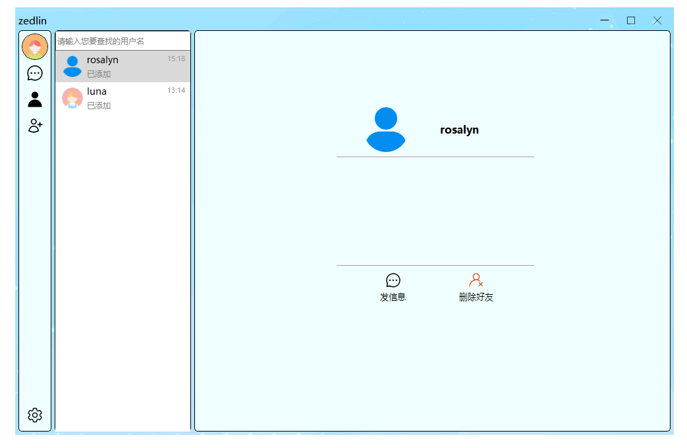
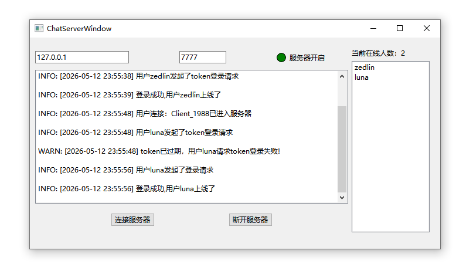

# QtChatRoom

一个基于 **Qt** 框架开发的局域网即时聊天室应用，采用 **Client / Server** 分离架构，支持好友管理、实时消息收发、用户资料修改等完整社交功能。

---

## 📸 界面预览

| 登录界面 | 注册界面 |
|:---:|:---:|
|  |  |

| 主界面（会话列表） | 好友信息 |
|:---:|:---:|
|  |  |

| 好友申请 | 服务器管理界面 |
|:---:|:---:|
|  |  |

---

## 🗂️ 项目结构

```
QtChatRoom/
├── QTChatSocket/      # 客户端程序
├── QTChatServer/      # 服务端程序
├── Log/               # 运行日志输出目录
└── ChatServer演示图/  # 界面截图
```

---

## ✨ 功能特性

### 客户端（QTChatSocket）
- **账号系统**：用户注册、密码登录、Token 免密自动登录、修改密码、退出登录
- **实时聊天**：基于 TCP 的文字 / 表情 / 图片消息收发，气泡式消息展示
- **好友管理**：搜索用户、发送好友申请（含留言）、接受 / 拒绝申请、删除好友
- **用户资料**：自定义头像（圆形裁剪）、修改昵称，资料变更实时同步给在线好友
- **离线消息**：登录后自动拉取离线期间收到的消息与好友申请
- **会话列表**：按最新消息排序，支持未读红点提示
- **自定义窗口**：无边框设计，支持拖拽移动、边缘调整大小、最大化 / 最小化

### 服务端（QTChatServer）
- **TCP 服务**：基于 `QTcpServer` 监听连接，支持多客户端并发
- **MySQL 数据库**：线程级连接池（`SqlConnPool`），通过 RAII 自动管理连接生命周期
- **线程池**：固定 8 线程处理耗时数据库操作，避免阻塞网络线程
- **密码安全**：随机盐 + SHA-256 哈希存储，登录 / 修改密码均经过校验
- **Token 鉴权**：生成 UUID Token 持久化至数据库，客户端可凭 Token 静默重登
- **客户端超时**：3 分钟无响应自动断开并清理资源
- **异步日志**：独立日志线程，按日期分文件，单文件超 5 MB 自动切割，保留 7 天

---

## 🏗️ 技术架构

```
客户端                              服务端
┌─────────────────────┐            ┌──────────────────────────┐
│  Login / Register   │            │     ChatServer           │
│  MyMainWindow       │   TCP/JSON │  ┌─────────────────────┐ │
│  SocketBusiness ────┼────────────┼─▶│   ChatSocket (x N)  │ │
│                     │            │  └──────────┬──────────┘ │
│  本地数据存储:       │            │             │ 线程池任务  │
│  ├ UserInfoSDK      │            │  ┌──────────▼──────────┐ │
│  ├ MessageStore     │            │  │    ThreadPool (8)   │ │
│  ├ ChatStore        │            │  └──────────┬──────────┘ │
│  └ FriendApplyStore │            │             │ RAII 连接   │
└─────────────────────┘            │  ┌──────────▼──────────┐ │
                                   │  │   SqlConnPool       │ │
                                   │  │   (MySQL per-thread)│ │
                                   │  └─────────────────────┘ │
                                   │  Log (异步, 按日切割)     │
                                   └──────────────────────────┘
```

**通信协议**：客户端与服务端通过 TCP 传输 JSON 数据包，使用 4 字节包头标识消息长度，支持粘包拆包处理。

---

## 🚀 快速开始

### 环境要求

| 依赖 | 版本要求 |
|------|---------|
| Qt | 5.x / 6.x |
| MySQL | 5.7+ |
| 编译器 | MSVC 2019+ / GCC 9+ / Clang 12+ |

### 数据库配置

在 `QTChatServer/main.cpp` 中取消注释并填写你的 MySQL 连接信息：

```cpp
SqlConnPool::Instance().init("host", 3306, "dbname", "user", "password");
```

### 编译与运行

1. 分别使用 Qt Creator 打开 `QTChatServer` 和 `QTChatSocket` 目录
2. 先编译并运行 **服务端**，在服务端界面中启动监听（默认端口 `7777`）
3. 编译并运行 **客户端**，注册账号后即可登录使用

> 客户端默认连接 `127.0.0.1:7777`，如需修改请在 `QTChatSocket/SocketBusiness.h` 中调整 `host` 与 `port` 常量。

---

## 📦 主要模块说明

### 客户端核心类

| 类名 | 说明 |
|------|------|
| `SocketBusiness` | 单例，封装所有 TCP 通信逻辑，对外暴露信号槽接口 |
| `UserInfoSDK` | 单例，管理本地用户信息缓存，变更时广播信号 |
| `MessageStore` | 单例，按会话 ID 缓存聊天消息，线程安全 |
| `ChatStore` | 单例，管理会话列表，监听新消息自动更新 |
| `FriendApplyStore` | 单例，管理好友申请列表 |
| `MyMainWindow` | 主窗口，集成会话、好友、申请三大页面 |
| `DisplayAnimation` | 通用淡入淡出动画辅助类 |
| `FloatingScrollBar` | 自定义悬浮滚动条 |

### 服务端核心类

| 类名 | 说明 |
|------|------|
| `ChatServer` | 继承 `QTcpServer`，管理所有连接及在线用户表 |
| `ChatSocket` | 单个连接的业务处理，含登录/注册/消息/好友等所有协议 |
| `ThreadPool` | 固定大小线程池，处理数据库等阻塞操作 |
| `SqlConnPool` | 基于 `QThreadStorage` 的线程级 MySQL 连接池 |
| `SqlConnRAII` | RAII 封装，自动归还数据库连接 |
| `Log` | 异步日志系统，支持 DEBUG / INFO / WARN / ERROR 四级 |

---

## 📄 License

本项目仅供学习与参考使用。
